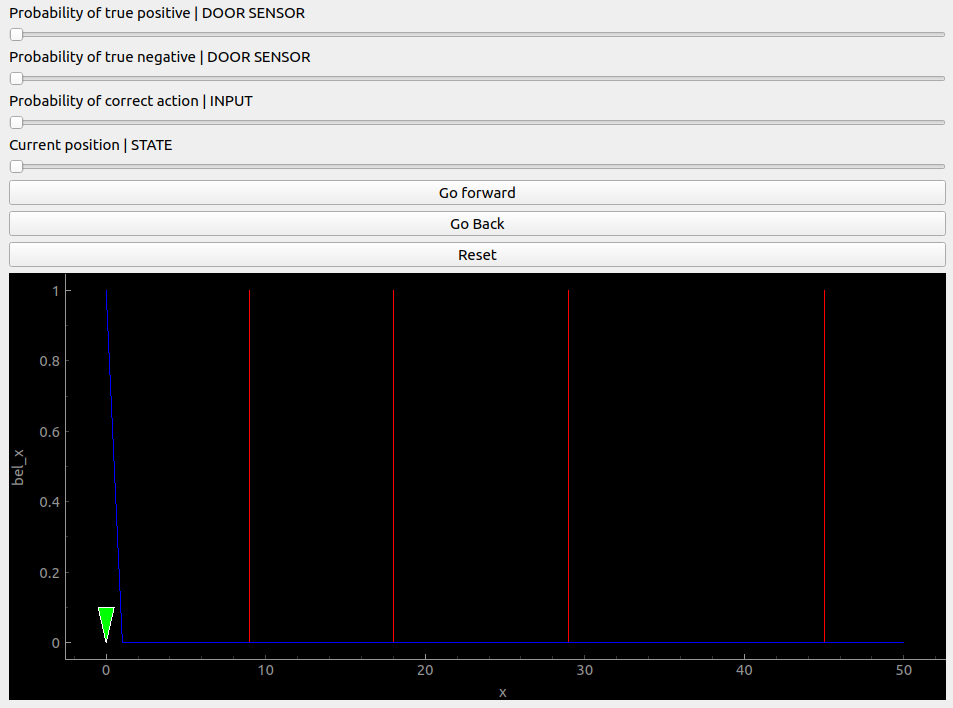

# Understanding-Bayes-Filter
An interactive GUI based plot is made to understand the concepts of Bayes filter through a simple example in 1D. 

## Setup
- install the dependencies listed in [requirements.txt](./requirements.txt)

## Run 
- To launch the plot run:
    ``` console
    python3 main.py
    ```

Upon running the above-mentioned Python script a plot similar to the one shown in the image below would come up. In this plot, 
- The green marker indicates the current position of the robot
- The red vertical lines indicates the positions of the doors
- The blue line indicates the belief/ probability distribution of the Robot's position 
- The first three sliders can be used to tweak uncertainties in the sensor and actuator with the extreme left position corresponding to 0 and the extreme right corresponding to 1. 
- The fourth slider can be used to change the position of the robot
- `Go Forward` and `Go Back` are the possible input to the system upon which the robot would try to move forward and backward as commanded. The odds of the robot moving depend on the actuator uncertainty.
- The `Reset` button can be used to reset the probability distribution of the Robot's position. If pressed once the probability distribution is set at unity at the current position and zero elsewhere and upon pressing it again the distribution is set to uniform.

